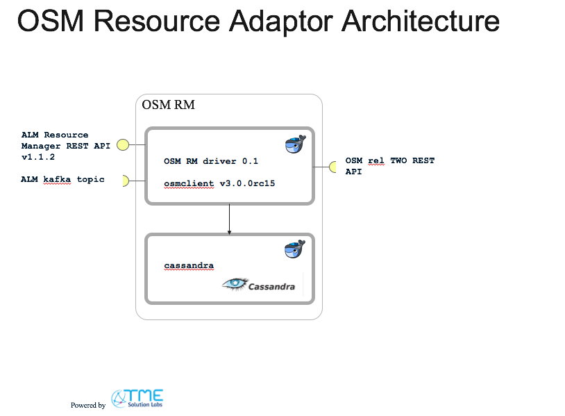

# ALM Resource Manager for OpenSource MANO (OSM)
For a more detailed overview and context of this project reference the [opensource service lifecycle management project]( https://github.com/IBM/open-source-service-lifecycle-mgmt/blob/master/README.md)

This project provides an IBM Agile Lifecycle Manager (ALM) v1.2 Resource Manager (RM) for the OpenSource MANO (OSM) release TWO (see https://osm.etsi.org/ ).

The OSM API is implemented by the osmclient python library (see [here](https://osm.etsi.org/wikipub/index.php/RO_Northbound_Interface) for more details on the OSM northbound REST API and [here](https://osm.etsi.org/wikipub/index.php/OsmClient) for the osmclient ).
The ALM-RM API is built using swagger 2.0, and the python-flask server code generator.

It implements the ALM Resource Manager API Specification and is tested against ALM v1.2

In this architecture ALM acts as uber_ or domain orchestrator. The OSM concepts are mapped into an ALM world as follows:

| OSM concept    | ALM concept     | strategy
|----------------|-----------------|----------------
| Network Service Descriptor (nsd)| Resource Descriptor (rd)| rd is auto-generated from the nsd by the adaptor
| Network Service (ns)| Resource Instances | OSM is master, adaptor passes thru (OSM to ALM)
| VNF descriptor (vnfd)| n/a| |
| VNF (instance) | Internal Resource Instance | name and id is returned to ALM at NS creation time
| Virtual Link Descriptor (vld)| Resource Descriptor property | auto-generated, vld name and id are defined as read-onyl properties
| VIM/datacenter| deployment location| OSM is master, adaptor passes thru (OSM to ALM)
| Virtual Link (vl)| Internal Resource Instance | name and id is returned to ALM at NS creation time

The current architecture:

This resource manager is packaged in two docker containers managed by docker-compose.
- container running python3, the swagger server and the osmclient
- container running cassandra 3

Folders for logging shared with the host.
You should find them in <install_dir>/var_alm_osm_rm/driver/logs

## Pre-reqs
- docker version >= 17.06.0-ce
- docker-compose version >= 1.14.0

The images have been tested on MacOS 10.12 and ubuntu xenial

## Installation
The steps to install this resource manager are described [here](docs/installation.md).
